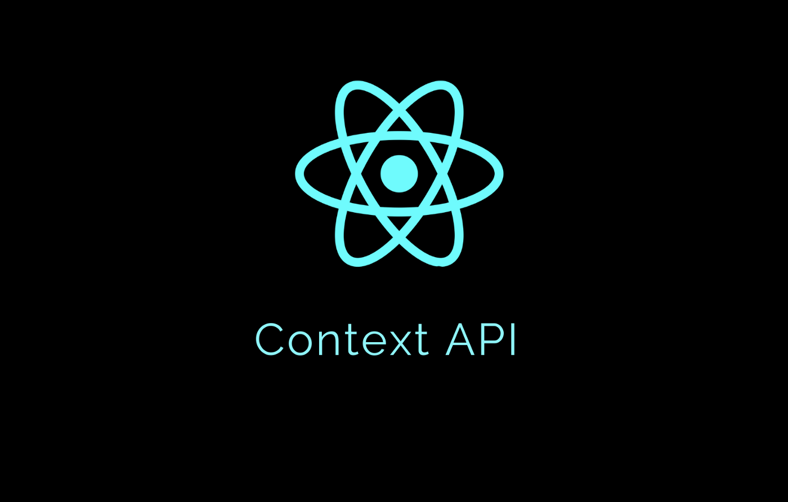

# State Management in React: An Introduction to Context API.

This was project was created to explain the concept of state manegement and Context API in React.

You can find the article here: [State Management in React: An Introduction to Context API.](https://emmanueloloke.hashnode.dev/state-management-in-react-an-introduction-to-context-api)

